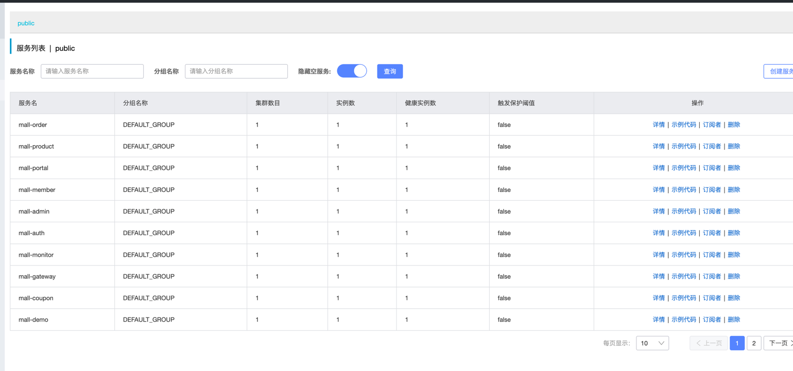
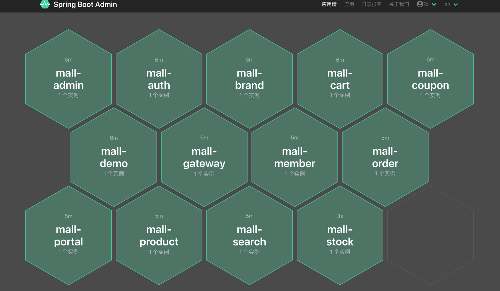
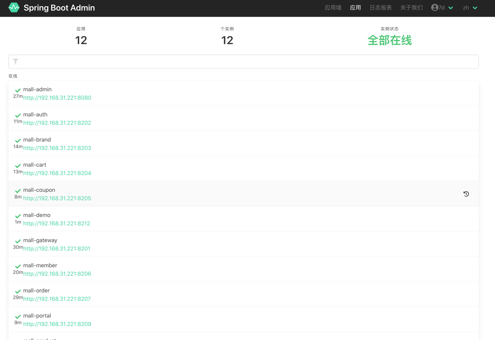
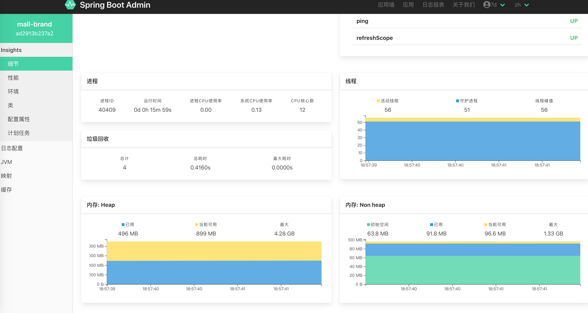
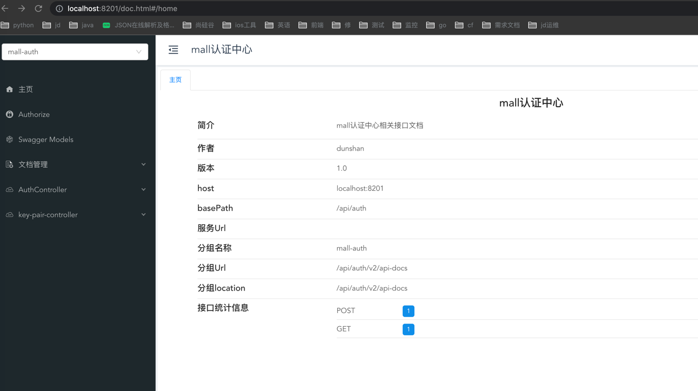

# 7d-mall

背景说明
极客时间「 [高楼的性能工程实战课](https://time.geekbang.org/column/intro/100074001?tab=intro) 」专栏项目

[全链路压测实战 30 讲](https://time.geekbang.org/column/intro/100093001?tab=catalog)

课程地址：https://time.geekbang.org/column/intro/100074001?tab=intro

项目介绍
7d-mall-microservice 是一套微服务电商，其是在开源电商项目 mall-swarm 上进行了改造，采用了 Spring Cloud Hoxton & Alibaba、Spring Boot 2.3、Oauth2、MyBatis、Docker、k8s、Elasticsearch 等核心技术。 7d-mall-microservice在电商业务的基础集成了注册中心、配置中心、监控中心、网关等系统功能。。
## 系统架构图


## 组织结构

``` lua
mall
├── mall-common -- 工具类及通用代码模块
├── mall-mbg -- MyBatisGenerator生成的数据库操作代码模块
├── mall-auth -- 基于Spring Security Oauth2的统一的认证中心
├── mall-gateway -- 基于Spring Cloud Gateway的微服务API网关服务
├── mall-monitor -- 基于Spring Boot Admin的微服务监控中心
├── mall-admin -- 后台管理系统服务
├── mall-search -- 基于Elasticsearch的商品搜索系统服务
├── mall-portal -- 移动端商城系统服务
├── mall-brand -- 移动端品牌系统服务
├── mall-cart  -- 移动端购物车系统服务
├── mall-coupon  -- 移动端优惠劵系统服务
├── mall-member  -- 移动端会员系统服务
├── mall-order  -- 移动端订单系统服务
├── mall-product  -- 移动端商品系统服务
├── mall-demo -- 微服务远程调用测试服务
└── config -- 配置中心存储的配置
```

## 项目文档

## 项目演示

## 技术选型

### 后端技术

| 技术                   | 说明                 | 官网                                                 |
| ---------------------- | -------------------- | ---------------------------------------------------- |
| Spring Cloud           | 微服务框架           | https://spring.io/projects/spring-cloud              |
| Spring Cloud Alibaba   | 微服务框架           | https://github.com/alibaba/spring-cloud-alibaba      |
| Spring Boot            | 容器+MVC框架         | https://spring.io/projects/spring-boot               |
| Spring Security Oauth2 | 认证和授权框架       | https://spring.io/projects/spring-security-oauth     |
| MyBatis                | ORM框架              | http://www.mybatis.org/mybatis-3/zh/index.html       |
| MyBatisGenerator       | 数据层代码生成       | http://www.mybatis.org/generator/index.html          |
| PageHelper             | MyBatis物理分页插件  | http://git.oschina.net/free/Mybatis_PageHelper       |
| Knife4j                | 文档生产工具         | https://github.com/xiaoymin/swagger-bootstrap-ui     |
| Elasticsearch          | 搜索引擎             | https://github.com/elastic/elasticsearch             |
| RabbitMq               | 消息队列             | https://www.rabbitmq.com/                            |
| Redis                  | 分布式缓存           | https://redis.io/                                    |
| MongoDb                | NoSql数据库          | https://www.mongodb.com/                             |
| Docker                 | 应用容器引擎         | https://www.docker.com/                              |
| Druid                  | 数据库连接池         | https://github.com/alibaba/druid                     |
| OSS                    | 对象存储             | https://github.com/aliyun/aliyun-oss-java-sdk        |
| MinIO                  | 对象存储             | https://github.com/minio/minio                       |
| JWT                    | JWT登录支持          | https://github.com/jwtk/jjwt                         |
| LogStash               | 日志收集             | https://github.com/logstash/logstash-logback-encoder |
| Lombok                 | 简化对象封装工具     | https://github.com/rzwitserloot/lombok               |
| Seata                  | 全局事务管理框架     | https://github.com/seata/seata                       |
| Portainer              | 可视化Docker容器管理 | https://github.com/portainer/portainer               |
| Jenkins                | 自动化部署工具       | https://github.com/jenkinsci/jenkins                 |
| Kubernetes             | 应用容器管理平台     | https://kubernetes.io/                               |

### 前端技术

| 技术       | 说明                  | 官网                           |
| ---------- | --------------------- | ------------------------------ |
| Vue        | 前端框架              | https://vuejs.org/             |
| Vue-router | 路由框架              | https://router.vuejs.org/      |
| Vuex       | 全局状态管理框架      | https://vuex.vuejs.org/        |
| Element    | 前端UI框架            | https://element.eleme.io/      |
| Axios      | 前端HTTP框架          | https://github.com/axios/axios |
| v-charts   | 基于Echarts的图表框架 | https://v-charts.js.org/       |


## 环境搭建

### 开发环境

| 工具          | 版本号 | 下载                                                         |
| ------------- | ------ | ------------------------------------------------------------ |
| JDK           | 1.8    | https://www.oracle.com/technetwork/java/javase/downloads/jdk8-downloads-2133151.html |
| Mysql         | 5.7    | https://www.mysql.com/                                       |
| Redis         | 5.0    | https://redis.io/download                                    |
| Elasticsearch | 7.6.2  | https://www.elastic.co/cn/downloads/elasticsearch            |
| Kibana        | 7.6.2  | https://www.elastic.co/cn/downloads/kibana                   |
| Logstash      | 7.6.2  | https://www.elastic.co/cn/downloads/logstash                 |
| MongoDb       | 4.2.5  | https://www.mongodb.com/download-center                      |
| RabbitMq      | 3.7.14 | http://www.rabbitmq.com/download.html                        |
| nginx         | 1.10   | http://nginx.org/en/download.html                            |

### 搭建步骤

[系统是怎么搭建](https://time.geekbang.org/column/article/378983)

## 运行效果展示

- 查看注册中心注册服务信息，访问地址：http://192.168.3.101:8848/nacos/



- 监控中心应用信息，访问地址：http://192.168.3.101:8101







- API文档信息，访问地址：http://192.168.3.101:8201/doc.hmtl


## 公众号

电商项目全套学习教程连载中，关注公众号「**7DGroup**」第一时间获取。

加微信群交流，公众号后台回复「**性能工程**」即可。
